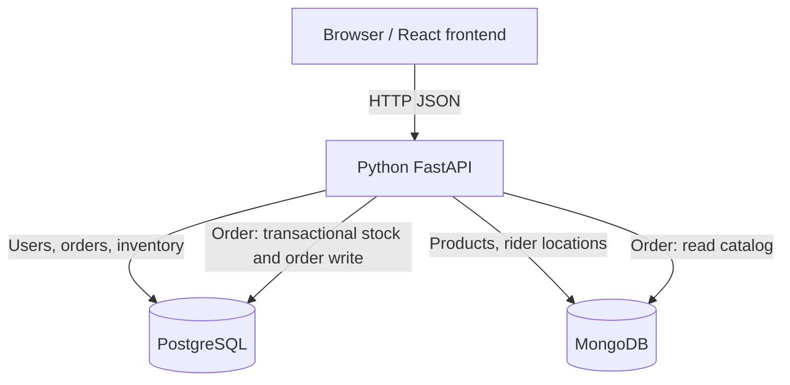

# DeliveryApp

Food delivery around Chiang Mai University. The Checkpoint 1 backend connects FastAPI to PostgreSQL for accounts, orders, and inventory, and to MongoDB for products and rider locations.

## Team and contributions

The roster below uses the student details provided by the team and links each person to their Git identity.

| Student ID | Member / Git identity | Current responsibility and contribution |
| --- | --- | --- |
| 670615020 | Jirasak Boonsom / Jirasak | Project setup, Orders API, integration, Products API, CP1 verification |
| 670615035 | Supanat Pudhom / beam2548 | Users API, account migration, PostgreSQL seed and tests |
| 650615037 | Anakin arsa / Anakin_Arsa | Project planning and handoff documentation |

Each member should continue contributing through a feature branch and a reviewed pull request. The Git history, not this table alone, is the evidence of individual work.

## Architecture



PostgreSQL owns transactional state. MongoDB owns flexible catalog documents and location telemetry. Product IDs match PostgreSQL inventory IDs. Creating a product writes to PostgreSQL first and MongoDB second; these writes are not a distributed atomic transaction. On a MongoDB failure, the API removes the new inventory row, and `scripts.verify_seed` detects catalog/inventory mismatches after an interrupted write. Order creation reads a product snapshot from MongoDB and commits stock and order rows together in PostgreSQL.

## Local setup

Install Git and Docker Desktop. Clone the repository and create a local environment file:

```bash
cp .env.example .env
```

On PowerShell, use `Copy-Item .env.example .env`. Replace every `replace-with...` or `change-me...` value in `.env` with your own local values. In particular, set a long `AUTH_SECRET` and a demo `SEED_USER_PASSWORD` of at least eight characters. `.env` is ignored by Git. The database port defaults are 5432 and 27017; change `POSTGRES_PORT` or `MONGO_PORT` in `.env` if those host ports are occupied.

Start the stack, seed both databases, and verify the data:

```bash
docker compose up -d --build --wait
docker compose exec -T api python -m scripts.seed
docker compose exec -T api python -m scripts.verify_seed
docker compose ps
```

The API container applies the Alembic migration history on startup. To apply a later migration manually, run `docker compose exec -T api alembic upgrade head`. Do not run a second copy of the same DDL manually. Named Docker volumes preserve data after `docker compose down`; seeding can be rerun without resetting existing stock, prices, or passwords.

| Service | Default local URL |
| --- | --- |
| Frontend setup page | http://localhost:5173 |
| API and Swagger | http://localhost:8000/docs |
| API health | http://localhost:8000/health |
| PostgreSQL | localhost:5432 |
| MongoDB | localhost:27017 |

The frontend is currently a setup page. Checkpoint 1 is a backend milestone; the customer UI and live rider map are later work.

## API endpoint summary

| Method | Route | Purpose and database |
| --- | --- | --- |
| POST | `/api/v1/users` | Register a customer or rider in PostgreSQL |
| POST | `/api/v1/auth/login` | Get a bearer token for a seeded or registered user |
| GET | `/api/v1/users/{id}` | Read your own profile from PostgreSQL |
| GET | `/api/v1/products?restaurant_id={uuid}&limit=20&offset=0` | Paginated MongoDB catalog |
| POST | `/api/v1/products` | Merchant/admin token required; create MongoDB product and PostgreSQL inventory |
| POST | `/api/v1/orders` | Customer token and `Idempotency-Key` required; read MongoDB, write PostgreSQL transaction |
| GET | `/api/v1/orders`, `/api/v1/orders/{id}` | Read your own PostgreSQL orders |
| POST | `/api/v1/orders/{id}/cancel` | Cancel a placed order and restore stock once |

The seed creates `merchant@cmu.example` with the local `SEED_USER_PASSWORD`; log in with this account to create products. Register a customer through `POST /api/v1/users`, then log in as that customer to place orders. Product creation accepts `restaurant_id`, `name`, integer `price_satang`, integer `initial_stock`, and a flexible `attributes` object. See [the API contract](docs/api-contract.md) for request and response details.

## Verification and demo

```bash
docker compose exec -T api python -m unittest discover -s tests -p "test_*.py"
docker compose exec -T api python -m scripts.smoke_cp1
docker compose exec -T api python -m scripts.smoke_orders
```

The CP1 smoke test exercises all five required routes through HTTP and cleans up its temporary data. The Orders smoke test covers retries, stock conflicts, authorization, concurrency, and cancellation. GitHub Actions runs these checks against fresh Compose volumes on each pull request and push to `main`.

For the instructor audit, show the architecture above, `docker compose ps`, `scripts.verify_seed` output (10 restaurants, 101 users, 1,000 inventory rows, 1,000 products, and 20 rider locations), Swagger, and `scripts.smoke_cp1`. The [CP1 submission and audit guide](docs/cp1-submission.md) maps every handout requirement to repository evidence and provides a 10-minute demo sequence. See [the data model](docs/data-model.md), [decisions](docs/decisions.md), and [backlog](docs/backlog.md) for design notes.

For the course assignment upload, one team member runs `python tools/package_cp1.py` and uploads `dist/DeliveryApp_CP1_submission.zip`. The alternative is a public Google Drive/OneDrive link, but the ZIP upload avoids changing cloud-sharing permissions. See the submission guide for the exact handoff.
