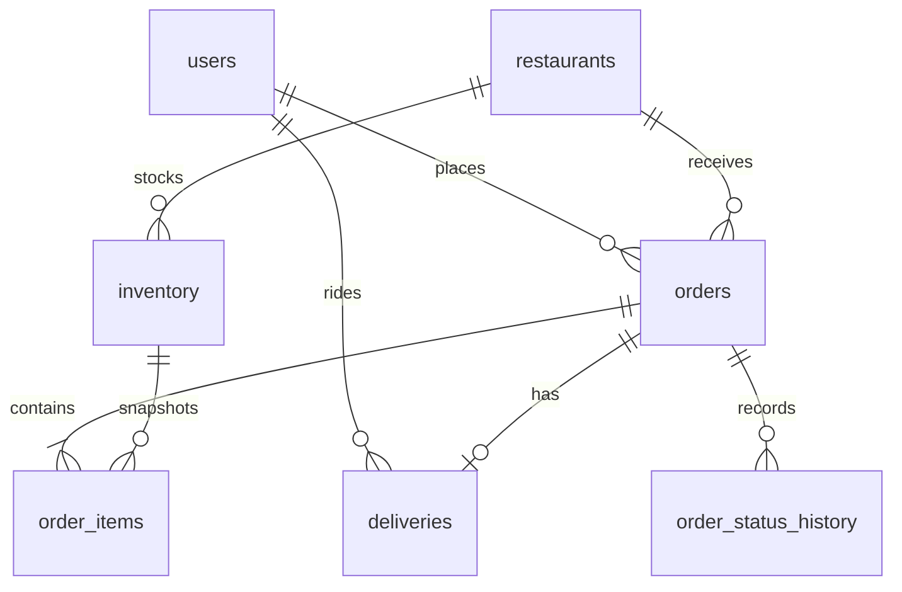

# Checkpoint 1 data model

The Alembic history is the executable PostgreSQL schema path: `0001_order_baseline` creates `users`, `restaurants`, `inventory`, `orders`, `order_items`, `deliveries`, and `order_status_history`; `0002_user_accounts` adds account credentials, roles, creation time, and a case-insensitive unique email index. The API container applies migrations on startup.

Primary and foreign keys enforce account, restaurant, order, item, and delivery relations. Check constraints prevent negative stock and invalid order totals. Query indexes cover restaurant inventory, customer order history, order items, status history, and case-insensitive email lookup. The order transaction locks inventory rows, stores a price snapshot, and updates stock and order records together.

MongoDB contains two CP1 collections:

| Collection | Document fields | Query index |
| --- | --- | --- |
| `products` | UUID string `_id`, restaurant UUID, name, integer `price_satang`, `active`, flexible `attributes` | `restaurant_id`, `active`, `_id` |
| `rider_locations` | Rider UUID `_id`/`rider_id`, latitude, longitude, UTC `updated_at` | `rider_id`, descending `updated_at` |

`products._id` equals `inventory.product_id`. The reproducible seed creates 10 restaurants, 101 users (80 customers, 20 riders, one demo merchant), and 1,000 inventory rows in PostgreSQL, plus 1,000 products and 20 rider locations in MongoDB. `scripts.verify_seed` checks collection counts, indexes, required fields, UUIDs, and every product/inventory link.

PostgreSQL is the source of truth for orders, stock, and delivery state. MongoDB is the source of truth for catalog details and location telemetry. No shared ACID transaction exists across the two engines. Product creation publishes the MongoDB document only after its stock row commits and compensates for a reported MongoDB failure. An interrupted or ambiguous write may leave an orphan; the verification command detects it for review. Order creation reads MongoDB and writes transactional state only to PostgreSQL.
